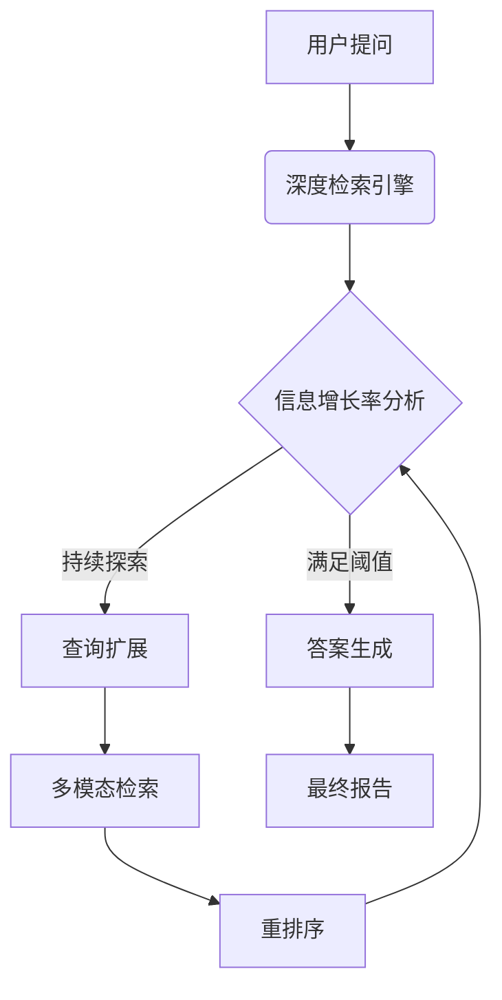

# 🔍 MetaSearch - 深度迭代检索增强系统

 <!-- 建议添加架构示意图 -->
[](https://www.python.org/)

## 🌟 欢迎你！
MetaSearch是一个教学项目！它可以帮助你学习如何运用大语言模型接口搭建一套先进的检索增强生成系统。本项目的架构设计、代码实现均遵从开源社区的最佳实践，帮助你深入理解RAG技术的核心原理、规范大语言模型项目的构建思路。

## Features
- 🧩 **模块化RAG系统开发** - 学习如何按照社区通用规范，构建一个大语言模型项目
- 🔄 **深度迭代检索** - 实现基于目前行业最佳的RAG算法
- 🎛️ **多模态检索融合** - 深度向量检索、关键词检索和知识图谱检索
- 📊 **生产级实践** - 项目代码编写规范：配置管理到日志系统的工程化实现

## 🚀 快速开始
### 1. 环境配置
```bash
# 创建并激活conda环境
conda create -n metasearch python=3.10 -y
conda activate metasearch

# 安装依赖（支持CUDA 11.8）
pip install -r requirements.txt
pip install torch==2.0.1+cu118 --extra-index-url https://download.pytorch.org/whl/cu118
```
编辑`config/config.yaml`文件，设置模型路径、API密钥等配置项。

### 2. 模型下载
```bash
# 推荐选项：下载Embedding和Reranker模型（约2.3GB）
python scripts/download_models.py --all --skip_qwen

# 或者，使用全量下载
python scripts/download_models.py --all
```
### 3. 处理文档

```bash
python scripts/process_documents.py --file data/raw/your_document.txt
```

### 4. 构建索引

```bash
python scripts/build_indexes.py --chunks data/processed/index_chunk.pkl
```

### 5. 系统启动
交互模式：
```bash
python app.py --interactive
```

单次查询：
```bash
python app.py --query "介绍下明朝的内阁首辅"
```

## 🧠 技术架构


## 📚 深入学习

想要深入了解MetaSearch的技术细节？我们为你准备了丰富的学习资源：

- 📖 [技术原理详解](docs/technical_report.md) - 深度迭代检索算法的理论基础
- 🎓 [代码导读](docs/code_walkthrough.md) - 核心模块实现思路与最佳实践

## 🤝 加入社区

MetaSearch是开源教学项目，欢迎各种形式的贡献：

- 🐞 发现Bug？[提交Issue](https://github.com/marstaos/MetaSearch/issues/new)
- 💡 有改进想法？[发起Pull Request](https://github.com/marstaos/MetaSearch/pulls)
- 🌟 喜欢这个项目？点个Star支持我们！

**欢迎你的fork和PR！** ✨

