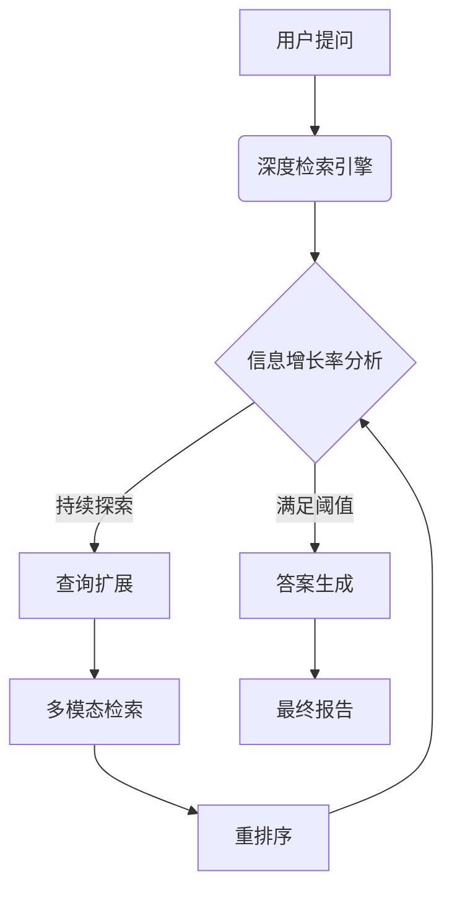

# 🤖 MetaSearch - Multi-Agent RAG 智能体协作系统

[](https://www.python.org/)
[](https://opensource.org/licenses/MIT)
[](https://github.com/marstaos/MetaSearch)

## 🌟 欢迎体验下一代RAG！
MetaSearch已升级为基于Multi-Agent协作的先进RAG系统！通过四大专门智能体协同工作，实现智能规划、精准检索、质量评估和优质生成。这是一个完整的教学项目，帮助你学习最前沿的AI协作模式和RAG技术。

**🚀 最新特性：Agent RAG系统**
- 🤖 **QueryPlannerAgent**: 智能分析查询复杂度，制定最优检索策略
- 🔍 **RetrievalAgent**: 执行多种检索策略，自适应调整检索参数
- 📊 **EvaluatorAgent**: 基于重排序的质量评估，智能决策下一步行动
- ✍️ **GeneratorAgent**: 整合多轮检索结果，生成高质量答案

在项目官网有更友好的介绍和入门：https://marstaos.github.io/MetaSearch/

## ✨ 核心特性
- 🤖 **Multi-Agent智能体协作** - 四大专门Agent协同工作，实现智能化RAG流程
- 🧠 **基于重排序的智能评估** - 自主决策检索质量，智能选择下一步行动
- 📊 **详细日志监控系统** - Agent级别的详细日志，时间戳命名，可追踪每步决策
- 🔄 **自适应检索策略** - 根据查询复杂度和评估结果动态调整策略
- ✨ **向后兼容传统模式** - 支持Agent模式和传统模式无缝切换
- 🎛️ **多模态检索融合** - 向量检索、关键词检索和知识图谱检索
- 📊 **生产级工程实践** - 规范的代码架构、配置管理和日志系统

## 🚀 快速开始
### 1. 环境配置
```bash
# 创建并激活conda环境
conda create -n metasearch python=3.10 -y
conda activate metasearch

# 安装依赖（支持CUDA 11.8）
pip install -r requirements.txt
pip install torch==2.0.1+cu118 --extra-index-url https://download.pytorch.org/whl/cu118
```
编辑`config/config.yaml`文件，设置模型路径、API密钥等配置项。

### 2. 模型下载
```bash
# 推荐选项：下载Embedding和Reranker模型（约2.3GB）
python scripts/download_models.py --all --skip_qwen

# 或者，使用全量下载
python scripts/download_models.py --all
```
### 3. 处理文档

```bash
python scripts/process_documents.py --file data/raw/your_document.txt
```

### 4. 构建索引

```bash
python scripts/build_indexes.py --chunks data/processed/index_chunk.pkl
```

### 5. 体验Agent RAG系统

**🤖 Agent RAG演示**（推荐）：
```bash
python demo_agent_rag.py
```

**🧪 系统测试**：
```bash
python test_agent_rag.py
```

**🚀 传统启动方式**：
交互模式：
```bash
python app.py --interactive
```

单次查询：
```bash
python app.py --query "介绍下明朝的内阁首辅"
```

## 🧠 技术架构

```mermaid
graph TD
    A[用户提问] --> B(深度检索引擎)
    B --> C{信息增长率分析}
    C -->|持续探索| D[查询扩展]
    C -->|满足阈值| E[答案生成]
    D --> F[多模态检索]
    F --> G[重排序]
    G --> C
    E --> H[最终报告]
```

## 📚 深入学习

想要深入了解MetaSearch的技术细节？我们为你准备了丰富的学习资源：

- 📖 [MetaSearch技术报告](docs/MetaSearch技术报告.md) - 深度迭代检索算法的理论基础
- 🎓 [代码导读](docs/代码导读.md) - 核心模块实现思路与最佳实践

## 🤖 Agent RAG 技术特色

### 智能体协作流程
```
用户查询 → QueryPlannerAgent → RetrievalAgent → EvaluatorAgent → GeneratorAgent
         ↑                                        ↓
         ← ← ← ← ← (continue/stop) ← ← ← ← ← ← ← ←
```

### 核心技术亮点

**🎯 智能规划**: QueryPlannerAgent分析查询复杂度，识别查询类型（事实型、分析型、比较型等），制定最优检索策略。

**🔍 精准检索**: RetrievalAgent支持向量、关键词、混合等多种策略，根据规划结果和轮次动态调整检索参数。

**📊 质量评估**: EvaluatorAgent基于重排序结果进行多维度评估（覆盖度、深度、一致性、新颖性），智能决策下一步行动。

**✍️ 优质生成**: GeneratorAgent整合多轮检索信息，支持详细、简洁、分析等多种生成格式。

**📈 监控日志**: 统一的日志系统，Agent级别的详细记录，支持性能分析和系统优化。

### 使用示例

```python
from deepsearch.rag.deep_rag import create_agent_rag

# 创建Agent RAG实例
agent_rag = create_agent_rag(searcher, llm, query_expander)

# 处理查询（Agent模式）
answer = agent_rag.answer("机器学习中的注意力机制是如何工作的？")

# 查看系统状态
status = agent_rag.get_system_status()
print(f"当前模式: {status['current_mode']}")
print(f"日志文件: {agent_rag.get_log_path()}")
```

## 🤝 加入社区

MetaSearch是开源教学项目，欢迎各种形式的贡献：

- 🐞 发现Bug？[提交Issue](https://github.com/marstaos/MetaSearch/issues/new)
- 💡 有改进想法？[发起Pull Request](https://github.com/marstaos/MetaSearch/pulls)
- 🌟 喜欢这个项目？点个Star支持我们！

**欢迎你的fork和PR！** ✨

