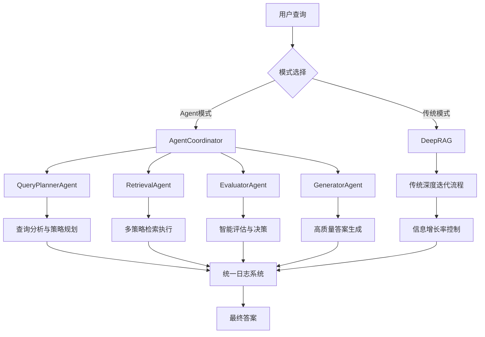

# MetaSearch系统技术报告

## 1. 系统概述

MetaSearch是一个**基于Multi-Agent协作的下一代RAG（检索增强生成）系统**，通过智能体协作和深度迭代检索，实现更加智能、灵活和高效的知识探索。系统支持传统深度迭代检索和Agent协作两种模式。

### 🚀 系统特色（2.0升级）

**Multi-Agent协作架构**：四大专门智能体协同工作
- **QueryPlannerAgent**：智能查询规划和策略制定  
- **RetrievalAgent**：自适应检索执行
- **EvaluatorAgent**：智能评估和决策
- **GeneratorAgent**：高质量答案生成

**传统深度迭代检索**：经典的多轮检索策略

### 核心特性：
  **🤖 智能体协作**：多个专门Agent协同工作，实现智能化的RAG流程
  **🎯 智能决策**：基于评估结果动态调整检索策略和流程控制
  **📊 完全可观测**：详细日志记录每个Agent的决策过程
  **🔄 深度迭代检索**：不同于传统RAG的单次检索，通过多轮检索不断深入探索相关信息
  **🔀 多模态检索融合**：结合向量检索、关键词检索和知识图谱检索，覆盖更广泛的相关内容
  **💡 智能查询扩展**：使用大模型动态生成子查询，实现知识探索的广度和深度
  **📈 自适应搜索**：根据新发现信息的比例和质量评估，动态决定是否继续搜索
  **⚖️ 多样性重排序**：使用MMR算法在相关性和多样性之间取得平衡

## 2. 系统架构总览



### 2.1 Multi-Agent协作架构（2.0核心创新）🤖

MetaSearch 2.0引入了基于多智能体协作的全新架构：

1. **AgentCoordinator（协调器）**：系统核心大脑，负责协调所有Agent
2. **QueryPlannerAgent（规划智能体）**：分析查询并制定检索策略
3. **RetrievalAgent（检索智能体）**：执行多种检索策略
4. **EvaluatorAgent（评估智能体）**：评估结果质量并决策下一步行动
5. **GeneratorAgent（生成智能体）**：整合多轮结果生成高质量答案
6. **统一日志系统**：完整记录所有Agent的决策过程

### 2.2 传统模块架构

传统深度迭代RAG系统的核心模块：

1. **文档处理模块**：负责将原始文档分割成适当大小的文本块（chunks）
2. **索引构建模块**：构建向量索引、TF-IDF索引和知识图谱索引
3. **检索模块**：结合多种检索方式，获取与查询相关的文档
4. **查询扩展模块**：基于已检索到的信息，生成新的子查询
5. **深度RAG模块**：协调整个迭代检索过程，生成最终回答

## 3. 核心技术原理

### 3.0 Multi-Agent协作原理（2.0核心创新）🚀

#### 3.0.1 智能体架构设计

**BaseAgent基础架构**：
- 统一的Agent接口和生命周期管理
- 内置性能监控和状态管理
- 标准化的错误处理机制
- 统一的日志记录系统

**专门化智能体设计**：
- **QueryPlannerAgent**: 使用LLM分析查询复杂度，制定最优检索策略
- **RetrievalAgent**: 支持vector/keyword/hybrid三种检索模式，自适应参数调整
- **EvaluatorAgent**: 多维度质量评估（覆盖度、深度、一致性、新颖性），智能决策
- **GeneratorAgent**: 多轮结果整合，支持不同生成格式和质量控制

#### 3.0.2 协调机制

**AgentCoordinator协调原理**：
```python
# 核心协调流程
1. 查询规划阶段：QueryPlannerAgent分析查询
2. 多轮检索循环：
   - RetrievalAgent执行检索
   - EvaluatorAgent评估结果
   - 基于评估决定：深入检索/扩展检索/生成答案
3. 答案生成阶段：GeneratorAgent整合所有结果
```

**智能决策机制**：
- 基于LLM增强的质量评估
- 启发式规则作为降级备选
- 多轮检索的动态控制
- 错误处理和恢复策略

### 3.1 文档处理（传统模块）

文档处理模块将原始文档分割成固定大小的文本块（chunks），每个chunk包含以下信息：
- 内容（content）
- 唯一ID（chunk_id）
- 父块（parent）：包含更广泛上下文的块
- 摘要（abstract）：使用LLM生成的内容摘要

配置文件中定义了chunk的大小和重叠部分的大小：

```yaml
processing:
  chunk_size: 512
  overlap_size: 30
```

### 3.2 多模态索引构建（传统模块）

系统支持三种类型的索引：

1. **向量索引**：使用预训练的语言模型（如BCE-Embedding）将文本转换为向量，并使用FAISS构建高效的向量检索索引
2. **TF-IDF索引**：基于词频-逆文档频率，适合关键词匹配
3. **知识图谱索引**：提取文本中的实体和关系，构建知识图谱

### 3.3 查询扩展机制（传统模块）

查询扩展是MetaSearch系统的亮点之一。它的步骤如下：

1. 对每个回答使用LLM提取关键搜索词
2. 计算这些搜索词与原始查询的相关性得分
3. 将所有候选子查询放入同一个池子中
4. 按得分降序排序，选择得分最高的几个
5. 将原始查询与选出的子查询合并，生成新的查询

这种设计从全局角度选择最有价值的子查询，而不是为每个回答单独生成固定数量的子查询。

### 3.4 深度迭代检索（传统模块）

深度迭代检索是整个系统的核心流程，它通过以下步骤工作：

1. 从用户的原始查询开始
2. 对每个查询执行标准RAG，获取回答
3. 计算信息增长率（新发现的chunk数量与已有chunk数量的比值）
4. 如果信息增长率低于阈值，结束迭代
5. 否则，使用查询扩展器生成新的子查询，进入下一轮迭代
6. 最终，使用所有收集到的知识生成综合回答

## 4. 流程示例

### 4.0 Agent协作流程示例（推荐）🤖

让我们通过一个具体例子来说明Agent协作系统的工作流程：

假设用户输入查询："明朝的内阁制度"

#### 第一阶段：查询规划

**QueryPlannerAgent执行**：
```json
{
  "query_analysis": {
    "query_type": "factual",
    "complexity": "medium", 
    "historical_context": true
  },
  "retrieval_plan": {
    "strategy": "hybrid",
    "multi_round_needed": true,
    "max_rounds": 3,
    "focus_areas": ["制度起源", "发展演变", "核心特征"]
  }
}
```

#### 第二阶段：多轮检索循环

**Round 1 - 初始检索**：
1. **RetrievalAgent执行**：使用hybrid策略检索
   - 获得文档：["明朝内阁制度起源于永乐年间...", ...]
   - 文档IDs: [101, 102, 103, 104, 105]

2. **EvaluatorAgent评估**：
   ```json
   {
     "coverage_score": 3,
     "depth_score": 2, 
     "consistency_score": 4,
     "novelty_score": 3,
     "overall_quality": 3.0,
     "recommended_action": "深入检索",
     "reasoning": "基础信息良好，但缺少具体实施细节",
     "focus_queries": ["明朝内阁首辅职能", "内阁与六部关系"]
   }
   ```

**Round 2 - 深入检索**：
1. **RetrievalAgent执行**：基于评估建议的聚焦查询
   - 新发现文档：["内阁首辅权力变迁...", "六部与内阁的权力制衡..."]
   - 新增文档IDs: [201, 202, 203]

2. **EvaluatorAgent评估**：
   ```json
   {
     "overall_quality": 4.2,
     "recommended_action": "生成答案",
     "reasoning": "信息覆盖全面，深度适中，可以生成高质量答案"
   }
   ```

#### 第三阶段：答案生成

**GeneratorAgent执行**：
- 整合所有轮次的检索结果
- 生成结构化答案包含：核心制度特征、历史发展脉络、具体实施细节
- 提供来源引用和置信度评估

### 4.1 传统深度迭代流程示例

传统模式下的具体工作流程（保持原有内容）：

传统模式下的具体工作流程：

假设用户输入查询："明朝的内阁制度"

### 第一轮迭代

1. **初始化**：
   ```
   sub_queries = ["明朝的内阁制度"]  # 只有一个原始查询
   knowledge = []  # 空知识库
   exist_ids = set()  # 空ID集合
   ```

2. **执行标准RAG**：
   - 处理查询"明朝的内阁制度"
   - 假设获得回答: "明朝内阁制度起源于永乐年间..."
   - 假设获得文档IDs: [101, 102, 103, 104, 105]
   - 添加到知识库: knowledge = ["明朝内阁制度起源于永乐年间..."]
   - 记录回答: response_list = ["明朝内阁制度起源于永乐年间..."]
   - 新发现的IDs: new_ids = {101, 102, 103, 104, 105}

3. **计算信息增长率**：
   - info_growth_rate = 5 / 1 = 5.0 (高于阈值0.1)

4. **扩展查询**：
   - 使用查询扩展器从回答中提取关键词
   - 假设生成的候选子查询有: ["内阁首辅", "内阁权力", "张居正改革", "明朝政治体制", "内阁与皇权"]
   - 计算每个子查询与原始查询的相关性得分
   - 选择得分最高的3个: ["明朝内阁首辅", "明朝内阁制度演变", "明朝内阁与皇权关系"]

### 第二轮迭代

1. **执行标准RAG**：
   - 处理子查询1: "明朝内阁首辅"
     - 获得回答: "明朝内阁首辅是..."
     - 获得文档IDs: [201, 202, 103, 104]
   - 处理子查询2: "明朝内阁制度演变"
     - 获得回答: "明朝内阁制度经历了..."
     - 获得文档IDs: [301, 302, 303]
   - 处理子查询3: "明朝内阁与皇权关系"
     - 获得回答: "明朝内阁与皇权..."
     - 获得文档IDs: [401, 402, 103]
   
   - 更新知识库: knowledge = ["明朝内阁制度起源于...", "明朝内阁首辅是...", "明朝内阁制度经历了...", "明朝内阁与皇权..."]
   - 新发现的IDs: new_ids = {201, 202, 301, 302, 303, 401, 402} (排除已有的103, 104)

2. **计算信息增长率**：
   - info_growth_rate = 7 / 5 = 1.4 (高于阈值0.1)

3. **扩展查询**：
   - 对所有第二轮的回答提取关键词
   - 从所有候选子查询中选择得分最高的3个
   - 假设新的子查询为: ["张居正改革与内阁权力", "明朝内阁与六部的关系", "明朝后期内阁的衰落"]

### 第三轮迭代

以此类推，系统会继续迭代，直到信息增长率低于阈值或达到最大迭代次数。

### 最终回答生成

1. **格式化知识**：
   - 为每个知识点添加来源查询和相关度评分
   - 使用重排序模型计算每个知识点与原始查询的相关性

2. **生成最终回答**：
   - 构建提示词，包含原始问题和所有收集到的知识
   - 使用LLM生成综合回答，包括核心答案、详细阐述和个人见解

## 5. 关键代码解析

### 5.0 Agent系统核心代码（2.0新增）🔧

#### 5.0.1 AgentCoordinator核心协调逻辑

```python:deepsearch/agents/coordinator.py
def execute_agent_rag(self, query: str) -> str:
    """执行基于Agent协作的RAG流程"""
    # 1. 查询规划阶段
    planning_result = self.agents['planner'].execute({
        'task_type': 'plan_query',
        'query': query
    })
    
    # 2. 多轮检索循环
    max_rounds = planning_result.get('max_rounds', 4)
    current_round = 0
    collected_knowledge = []
    
    while current_round < max_rounds:
        # 检索执行
        retrieval_result = self.agents['retrieval'].execute({
            'task_type': 'retrieve',
            'query': query,
            'strategy': planning_result.get('strategy', 'hybrid'),
            'round': current_round
        })
        
        # 结果评估  
        evaluation_result = self.agents['evaluator'].execute({
            'task_type': 'evaluate',
            'query': query,
            'retrieval_results': retrieval_result,
            'collected_knowledge': collected_knowledge
        })
        
        # 基于评估决策下一步
        if evaluation_result['recommended_action'] == '生成答案':
            break
        elif evaluation_result['recommended_action'] == '深入检索':
            query = evaluation_result.get('focus_query', query)
            
        current_round += 1
    
    # 3. 生成最终答案
    final_answer = self.agents['generator'].execute({
        'task_type': 'generate_answer', 
        'original_query': query,
        'collected_knowledge': collected_knowledge
    })
    
    return final_answer['content']
```

#### 5.0.2 智能评估决策逻辑

```python:deepsearch/agents/evaluator_agent.py
def _evaluate_with_llm(self, query: str, reranked_results: List) -> Dict:
    """使用LLM进行智能评估"""
    prompt = f"""
    评估以下经过重排序的检索结果的质量：
    
    原始查询：{query}
    检索结果：{reranked_results[:3]}  # 只评估top-3
    
    请从以下维度评分（1-5分）：
    1. coverage_score: 信息覆盖度
    2. depth_score: 信息深度
    3. consistency_score: 信息一致性  
    4. novelty_score: 信息新颖性
    
    并建议下一步行动：深入检索、扩展检索、或生成答案
    """
    
    response = self.llm(prompt)
    return self._parse_evaluation_response(response.content)
```

#### 5.0.3 统一日志系统

```python:deepsearch/agents/logger.py
class AgentLogger:
    """日志系统的核心功能..."""
    
    def log_agent_execution(self, agent_name: str, task: Dict, 
                          result: Dict, execution_time: float):
        """记录Agent执行详情"""
        log_entry = {
            'timestamp': datetime.now(),
            'agent': agent_name,
            'task_type': task.get('task_type'),
            'execution_time': execution_time,
            'result_summary': self._summarize_result(result),
            'decision_reasoning': result.get('reasoning', '')
        }
        
        self.logger.info(f"[{agent_name}] {log_entry}")
```

### 5.1 传统深度RAG代码（保持原有）

### 5.1 查询扩展器

查询扩展器负责生成新的子查询：

```python:d:\Playground\MetaSearch\deepsearch\rag\query_expander.py
def extend_query(
    self, 
    queries: List[str], 
    responses: List[str], 
    num: int = 10
) -> List[str]:
    """扩展查询集合"""
    logger.info(f"开始扩展查询，原始查询数: {len(queries)}")
    
    all_queries_scores = []
    
    for query, response in zip(queries, responses):
        if response is None:
            continue
            
        # 生成子查询及其得分
        queries_scores = self.generate_subquery(query, response, num)
        all_queries_scores.extend(queries_scores)
    
    # 按得分降序排序
    all_queries_scores = sorted(all_queries_scores, key=lambda s: s[2], reverse=True)
    
    # 选择前num个进行合并
    next_queries = [
        self.combine_query(s[0], s[1]) 
        for s in all_queries_scores[:num]
    ]
    
    logger.info(f"查询扩展完成，新生成查询数: {len(next_queries)}")
    return next_queries
```

### 5.2 深度RAG流程

深度RAG模块协调整个迭代检索过程：

```python:d:\Playground\MetaSearch\deepsearch\rag\deep_rag.py
def answer(self, query: str) -> str:
    """深度RAG问答流程"""
    # 初始化
    sub_queries = [query]  # 初始子查询就是原始查询
    knowledge = []  # 存储收集到的知识
    exist_ids = set()  # 已检索到的chunk ID集合
    
    # 迭代深度搜索
    for i in range(self.max_iterations):
        new_ids = set()
        response_list = []
        
        # 对每个子查询执行标准RAG
        for sub_query in sub_queries:
            response, ids = self._standard_rag(sub_query)
            knowledge.append(response)
            new_ids.update([s for s in ids if s not in exist_ids])
            response_list.append(response)
        
        # 计算信息增长率
        info_growth_rate = len(new_ids) / max(len(exist_ids), 1)
        
        # 更新已发现的chunk ID集合
        exist_ids.update(new_ids)
        
        # 如果信息增长率低于阈值，结束迭代
        if info_growth_rate < self.growth_rate_threshold:
            break
        
        # 如果不是最后一轮，扩展查询
        if i < self.max_iterations - 1:
            sub_queries = self.query_expander.extend_query(
                sub_queries, 
                response_list,
                self.extend_query_num
            )
    
    # 生成最终回答
    # ...
```

## 6. 系统配置

### 6.1 Agent系统配置（2.0新增）

```yaml:config/config.yaml
# Agent协作模式配置
agent_mode:
  enabled: true  # 是否启用Agent模式
  
# Agent协调器配置
coordinator:
  max_rounds: 4                 # 最大检索轮数
  max_execution_time: 300       # 最大执行时间（秒）
  enable_query_expansion: true  # 是否启用查询扩展
  fallback_on_error: true      # 错误时是否降级处理
  
# 各Agent具体配置
agents:
  planner:
    llm_enabled: true          # 是否使用LLM规划
    fallback_to_heuristic: true # LLM失效时使用启发式规则
    
  retrieval:
    default_strategy: "hybrid"  # 默认检索策略
    candidate_size: 50         # 候选文档数量
    final_size: 10            # 最终返回数量
    
  evaluator:
    llm_evaluation: true       # 是否使用LLM评估
    quality_threshold: 3.5     # 质量阈值
    
  generator:
    response_format: "detailed" # 回答格式：detailed/concise/analytical
    include_sources: true       # 是否包含来源信息
```

### 6.2 传统深度搜索配置

```yaml:config/config.yaml
# 深度搜索参数（传统模式）
deepsearch:
  max_iterations: 5
  growth_rate_threshold: 0.1
  extend_query_num: 10
```

### 6.3 配置参数说明

**Agent模式参数**：
- `max_rounds`: Agent协作的最大检索轮数
- `quality_threshold`: EvaluatorAgent的质量评估阈值
- `llm_evaluation`: 是否使用LLM进行智能评估（推荐开启）
- `fallback_to_heuristic`: LLM评估失效时使用启发式规则降级

**传统模式参数**：
- `max_iterations`: 最大迭代次数
- `growth_rate_threshold`: 信息增长率阈值，低于此值时停止迭代
- `extend_query_num`: 每轮生成的子查询数量

**模式切换**：通过`agent_mode.enabled`参数控制使用哪种模式

## 7. 性能对比与选择建议

### 7.1 Agent模式 vs 传统模式

| 特性 | Agent协作模式 | 传统深度迭代模式 |
|-----|-------------|---------------|
| **决策机制** | 基于LLM的智能决策 | 基于规则的静态决策 |
| **灵活性** | 高，动态调整策略 | 中，固定迭代流程 |
| **可观测性** | 完全，详细日志 | 有限，基础日志 |
| **适用场景** | 复杂查询，需要灵活决策 | 简单查询，追求效率 |
| **资源消耗** | 相对较高（LLM调用） | 较低 |
| **扩展性** | 优秀，易于添加新Agent | 有限，需要修改核心逻辑 |
| **错误恢复** | 智能，多级降级机制 | 基础，简单重试 |

### 7.2 使用建议

**选择Agent模式的场景**：
- 复杂的分析性查询
- 需要多角度信息整合
- 对答案质量要求较高
- 需要详细的决策过程追踪
- 系统具备充足的计算资源

**选择传统模式的场景**：
- 简单的事实性查询
- 追求响应速度
- 计算资源有限
- 查询模式相对固定

### 7.3 混合使用策略

系统支持基于查询复杂度的动态模式选择：
```python
# 智能模式选择示例
if query_complexity > threshold:
    use_agent_mode()
else:
    use_traditional_mode()
```

## 8. 总结与展望

### 8.1 系统优势

MetaSearch 2.0通过引入Multi-Agent架构，实现了：
- **智能化决策**：每个环节都有专门Agent负责，决策更加精准
- **完全可观测**：详细的日志记录让每个决策过程完全透明
- **高度灵活**：可以根据查询特点动态调整策略
- **易于扩展**：新功能可以通过添加Agent实现，不影响现有架构

### 8.2 未来发展方向

1. **更多专门Agent**：如FactCheckingAgent、SummarizationAgent等
2. **Agent间通信优化**：实现更复杂的协作模式
3. **多模态支持**：处理图像、音频等多媒体内容
4. **个性化Agent**：根据用户历史定制化Agent行为
5. **分布式Agent**：支持Agent在不同节点上运行

MetaSearch已经从传统RAG系统发展为下一代智能问答系统，展现了AI技术发展的最新趋势。